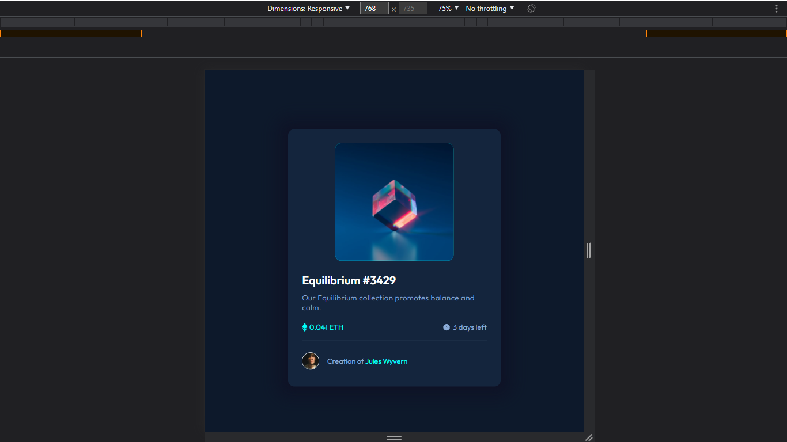
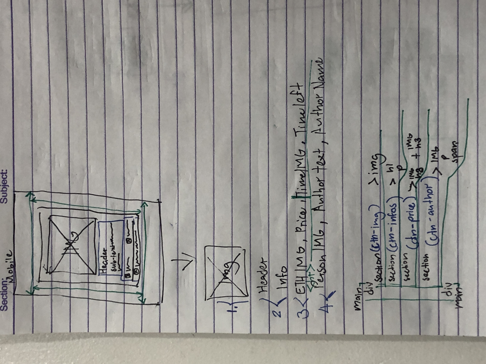

# Frontend Mentor - NFT Preview Card Component Solution
This is a solution to the [NFT preview card component challenge on Frontend Mentor](https://www.frontendmentor.io/challenges/nft-preview-card-component-SbdUL_w0U). 

<br>

Frontend Mentor challenges help you improve your coding skills by building realistic projects. 

## Table of contents:

- [Overview](#overview)
  - [The challenge](#the-challenge)
  - [Screenshot](#screenshots)
  - [Links](#links)
- [My process](#my-process)
  - [Built with](#built-with)
  - [What I learned](#what-i-learned)
  - [Continued development](#continued-development)
- [Author](#author)
- [Acknowledgments](#acknowledgments)
- [Notes](#notes)


## Overview:

### The challenge:

Users should be able to:
- View the optimal layout depending on their device's screen size
- See hover states for interactive elements
- Get it looking as close to the design as possible.

<br>

Preview of initial design:


### Screenshots:

<div align="center"> 

| Fullscreen View (Desktop) | 
|---------|
|  |

| Animated Preview (Not sure if this is 100% accurate due to height limit of screen) | 
|---------|
|  |

<br>

**Note: This is a Mobile-First Approach**

<br>

All viewports were included (except for the 4k view), in case the observer wishes to see the minor changes.

<br>

| Desktop View (1440px) | Laptop View (1024px) | Tablet View (768px) |
|---------|---------|---------|
|  |  |  |

| Mobile L (425px) | Mobile M (375px) | Mobile Small (320px) | 
|---------|---------|---------|
|  |  |  |

</div>

### Links:
- Live Site URL: [Website Link - Click Me](https://nft-prev-card-component.vercel.app/)
- Solution URL: [FrontEndMentor - Click Me](https://www.frontendmentor.io/solutions/nft-preview-card-component-mobilefirst-approach-flexbox-vQTJaQ2nzb)

## My process:

### Built with:
- HTML5
- CSS3
- Mobile-First Approach

### What I learned:

Recap over some of the major learnings while working through this project:

#### General things I've learned:
- Basic review of HTML & CSS
- CSS Flex Layout (I've got more comfortable utilzing it)
- Make more use of css variables to make the code more readable & clean
- Assign an initial static size in elements/containers before adjusting it or using display: flex  

#### New things I've found/learned better:
- I realized that **creating a wireframe on paper and visualizing it made the overall process of finishing it faster**
- This is much faster for quick and small planning, compared to digital wireframing like utilizing Figma 
  - Here is the sample paper of my wireframe/layout plan before I open a code editor: 

  <br> 

  
- Utilizing Position: relative and Position: absolute (Still confused a bit...)

<br>

This code snippets/function, is what **I'm proud to figure out**:

```css
.ctn-img > div {
  position: relative;
  background-color: var(--text-pri-cyan);
}

.card-img,
.overlay-icon {
  transition: 0.5s ease;
  backface-visibility: hidden;
}

.overlay-icon {
  opacity: 0;
  position: absolute;
  top: 50%;
  left: 50%;
  transform: translate(-50%, -50%);
  -ms-transform: translate(-50%, -50%);
}

.ctn-img > div:hover .card-img {
  opacity: 0.65;
}

.ctn-img > div:hover .overlay-icon {
  opacity: 1; /* Unhide eye overlay */
}

/* For me, the hardest part of the project is the image overlay. 
Combining both overlay color, icon, and the main card image. 
Though it wasn't 100% accurately correct... */
```


### Continued development:
<hr>

#### Here are a few possible areas that could be added or improved in the HTML and CSS code provided:
1. **Accessibility:** - It could be more accessible to users with disabilities. 
2. **Responsiveness:** - Using responsive design techniques and media queries for different screen sizes and devices.
3. **Browser Compatibility:** - Not all browsers support the same features and rendering of web pages from the CSS styles I used.
4. **Cleaner Maintainable Code** - I'm not quite sure about this one, but I'm sure there is a much better/cleaner approach to do what I did.

## Author:
- Github - [@Iron-Mark](https://github.com/Iron-Mark)
- Frontend Mentor - [@Iron-Mark](https://www.frontendmentor.io/profile/Iron-Mark)

## Acknowledgments:
- I would like to acknowledge the hard work and dedication I put into creating this website. 
- I am grateful for my friends and those who motivate me to push through and not settle for relaxation. 
- I hope that this website serves its intended purpose. Thank you!

## Notes:
- I would be happy to receive comments, criticism, and such that could improve the website:
  - Cleaner Code
  - Better Practice/Approach to making this website.
- Feel free to approach and contact me :>
  - _Feb, 8 2022 (Wireframing & Initial Plan) + (Initial Coding)_
  - _Feb, 9 2022 (Finish Coding) + (Documentation)_